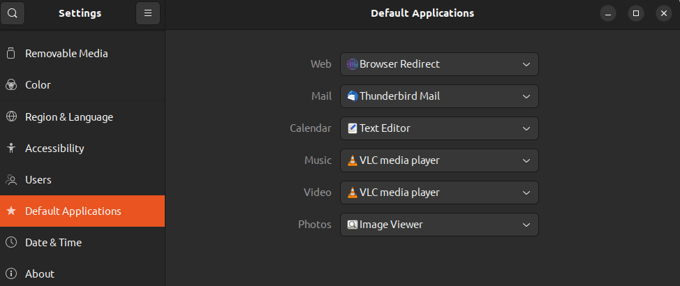

# browser-redirect

This is a bash based system to open a different browser depending on pattern matching in the URL.

Tested on __Ubuntu 22.04__ and __GNOME 42.5__

The script currently assumes __Firefox__ is the default browser and __Chromium__ is the alternative browser.

It will only redirect links made from outside of the browsers themselves. For example, if you open a link in the Discord or Slapp apps, this script will intercept and redirect appropriately but not when you click links inside of a browser.

## Install

```
git clone https://github.com/oc013/browser-redirect.git
cd browser-redirect
./install.sh
```

## Setup redirect matches
Edit the file created in your home directory named `browser-redirect-matches.txt` and add one pattern per line you would like to redirect to chromium.

POSIX regexs are supported for more advanced pattern matching needs. [See the `=~` operator here.](https://www.gnu.org/software/bash/manual/bash.html#index-_005b_005b)

Example `~/browser-redirect-matches.txt`:
```
meet.google.com
zoom.us
```

## Set as default browser
Now go to `Settings > Default Applications` and choose `Browser Redirect` in the dropdown menu for `Web`



## Attributions

* Install script inspired by: https://github.com/Browsers-software/browsers
* Icon created by nangicon: https://www.flaticon.com/free-icon/world-wide-web_10364676
